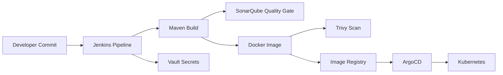
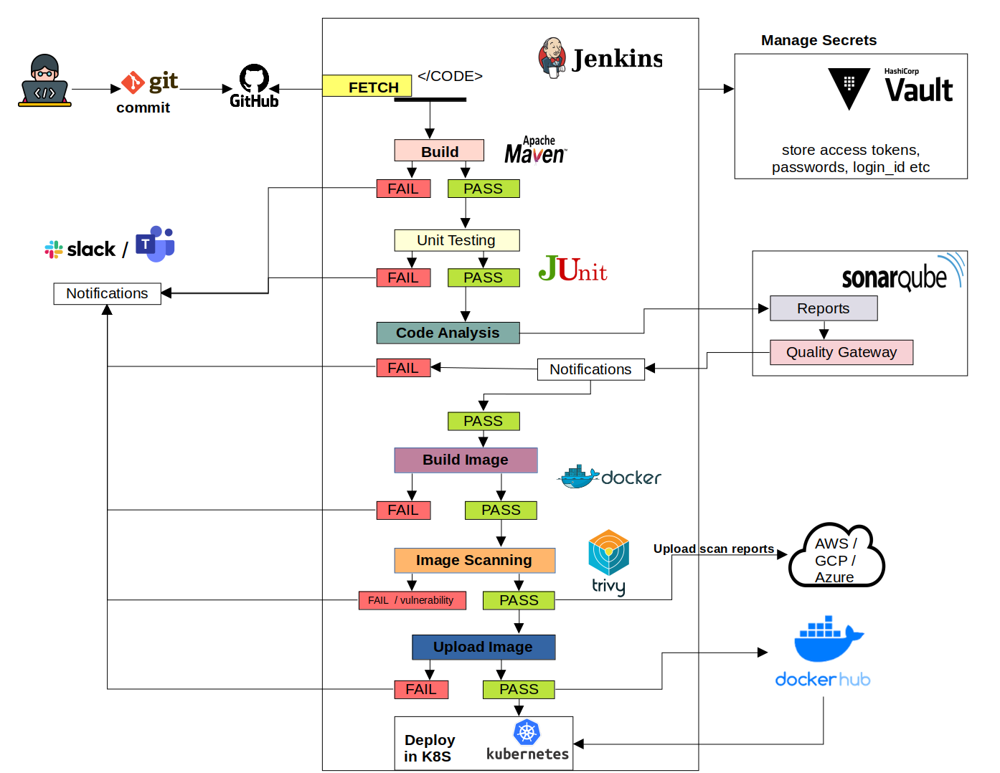
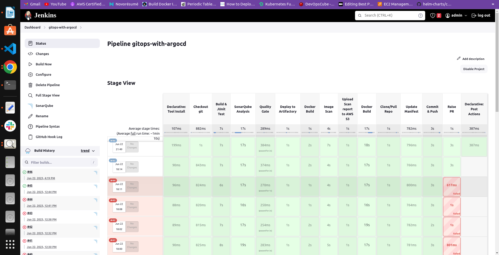
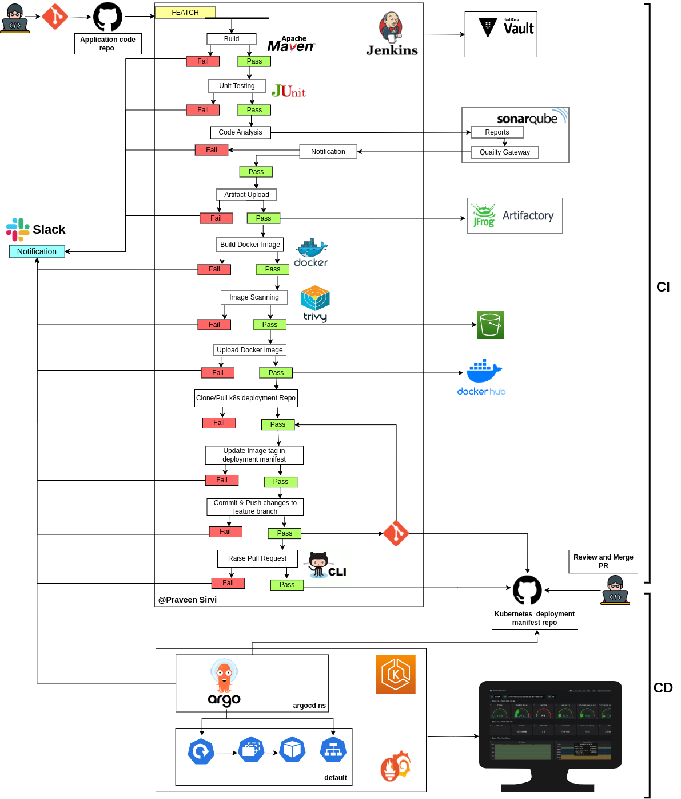
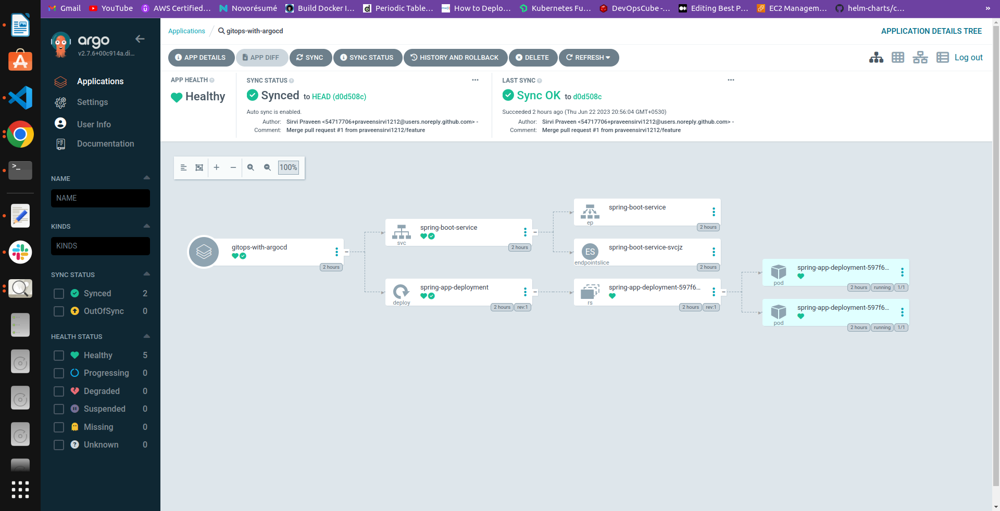
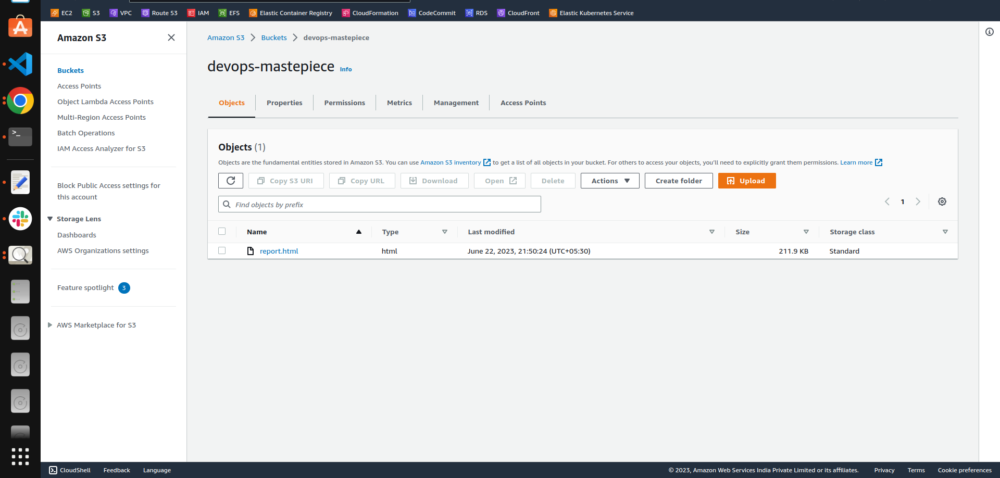
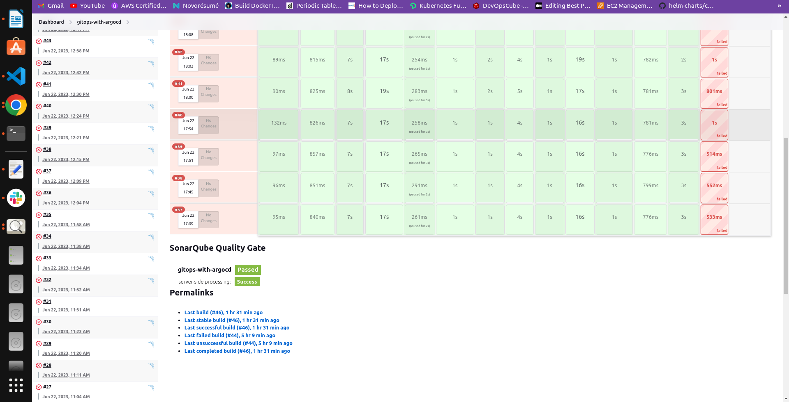

# Jenki ns CI/CD with ArgoCD, Vault, SonarQube and Trivy

> **Stage 11 of 12 — Career Progression Project**  
> Portfolio project by **Yugandhar Ethamukkala**.

Production-like DevSecOps pipeline project using Jenkins, Maven, SonarQube, Docker, Trivy, Vault-based secrets, artifact publishing, S3 report upload, and ArgoCD deployment workflow.

## Career Progression Story

Enterprise DevSecOps step: I combined Jenkins, security scanning, secret management, artifact handling, and GitOps deployment.

This repo is part of my 12-project DevOps portfolio path. The goal is to show steady growth from CI/CD foundations into AWS cloud, Kubernetes, GitOps, observability, DevSecOps, progressive delivery, and AI-enabled deployments.

## What This Project Demonstrates

- Strong enterprise CI/CD project with security and secret-management story.
- Good for explaining Jenkins credentials, Vault integration, image scanning, and GitOps deployment.
- Includes existing screenshots that make the repository visually stronger.

## Tech Stack

`Java` `Maven` `Jenkins` `Docker` `Kubernetes` `ArgoCD` `Vault` `SonarQube` `Trivy` `AWS S3`

## Architecture



## Repository Structure

```text
.
├── Dockerfile
├── Jenkinsfile
├── LICENSE
├── README.md
├── REPO_UPLOAD_CHECKLIST.md
├── docs/
├── images/
├── mvnw
├── mvnw.cmd
├── pom.xml
├── project.yaml
├── src/
```

## Prerequisites

- Git
- Docker where containers are used
- Cloud CLI/tools only when deploying cloud resources
- `kubectl`, `kind`, `terraform`, `sam`, `maven`, `npm`, or `python` depending on the project
- Never commit real `.env` files, API keys, access keys, kubeconfigs, private keys, or tokens

## Local Run

```bash
mvn clean package
docker build -t jenkins-argocd-vault-app:local .
docker run --rm -p 8080:8080 jenkins-argocd-vault-app:local
```

## Validation Before GitHub Upload

Run these checks before pushing major changes:

```bash
mvn -q test
test -f Jenkinsfile
docker build -t jenkins-argocd-vault-app:local .
```

## Deployment Overview

1. Create Jenkins credentials for Docker registry, Vault, Kubernetes, and AWS/S3 if used.
2. Run Jenkins pipeline stages for build, test, scan, image push, and manifest update.
3. Use ArgoCD to sync the application into Kubernetes.
4. Review SonarQube and Trivy results before promotion.

## Screenshots

The project already included these snapshots, so I added them into the README. Replace them with your own latest run screenshots when you execute the lab.

### Architecture diagram



### Jenkins dashboard



### Pipeline view



### ArgoCD sync view



### Trivy scan report



### SonarQube quality gate



## Cleanup / Cost Control

Run cleanup commands after testing so cloud resources do not keep charging:

```bash
kubectl delete -f manifests/ --ignore-not-found=true || true
docker image rm jenkins-argocd-vault-app:local || true
aws s3 rm s3://YOUR-SCAN-REPORT-BUCKET/ --recursive || true
```

## Security Notes

- Use GitHub Actions OIDC, Jenkins credentials, AWS Secrets Manager, Vault, or Kubernetes Secrets instead of hard-coded keys.
- Keep `.env` files local and commit only `.env.example` with safe placeholders.
- Review Terraform plans before apply/destroy.
- Do not publish account IDs, private IPs, public IPs from your lab, billing pages, or credential screenshots.

## How I Would Explain This in an Interview

I built this project as part of my DevOps portfolio to show hands-on experience with the tools used in real delivery environments. The focus is not only on writing code, but also on creating a repeatable workflow for build, validation, deployment, security, monitoring, and cleanup.

In a real project, I would connect this type of setup with environment-specific variables, approval gates, secrets management, monitoring dashboards, and rollback steps so teams can release safely and troubleshoot faster.

---

<p align="center">
  
</p>

<h2 align="center">🤝 Connect With Me</h2>

<p align="center">
  <em>
    Thanks for visiting this project! I’m continuously building hands-on DevOps, Cloud, Automation, and AI-enabled engineering projects to improve real-world deployment, monitoring, and infrastructure skills.
  </em>
</p>

<p align="center">
  
</p>

<p align="center">
  <a href="https://github.com/yugandhar99" target="_blank" rel="noopener noreferrer">
    
  </a>
  <a href="https://www.linkedin.com/in/yugandhar-devops" target="_blank" rel="noopener noreferrer">
    
  </a>
  <a href="https://yugandhar-portfolio-psi.vercel.app/" target="_blank" rel="noopener noreferrer">
    
  </a>
  <a href="mailto:yugandharethamukkala1999@gmail.com">
    
  </a>
</p>

<p align="center">
  
  
  
  
</p>

---

<p align="center">
  ⭐ If this project added value, feel free to star the repository and connect with me!
</p>

<p align="center">
  <strong>Built with ❤️ using modern DevOps practices</strong>
</p>

